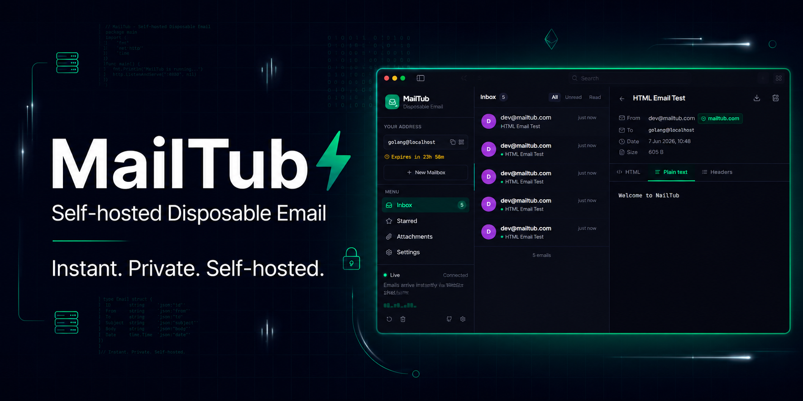
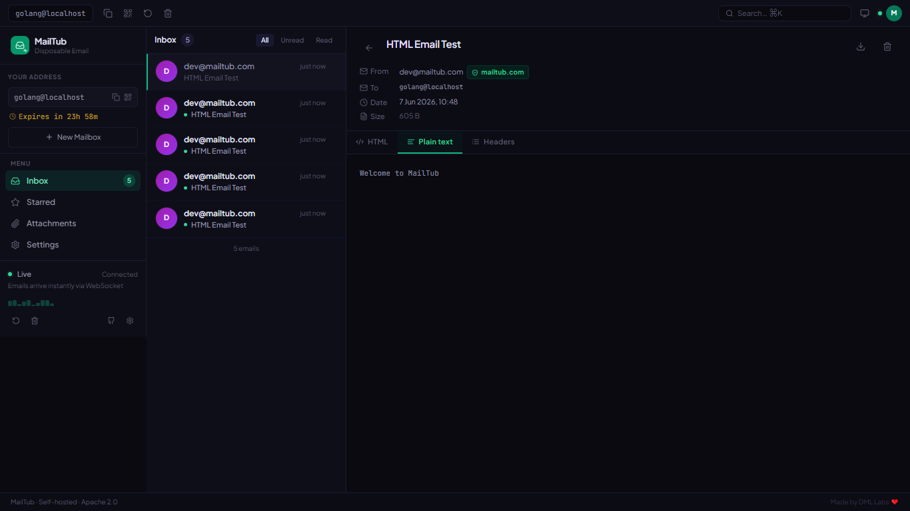
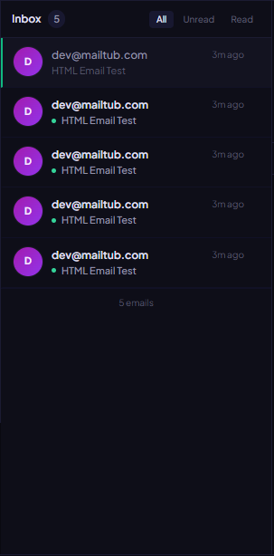
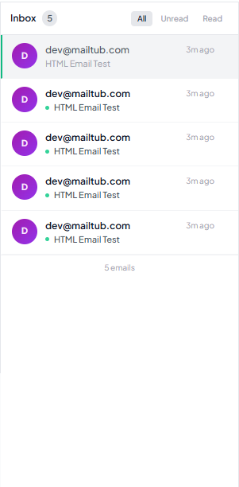
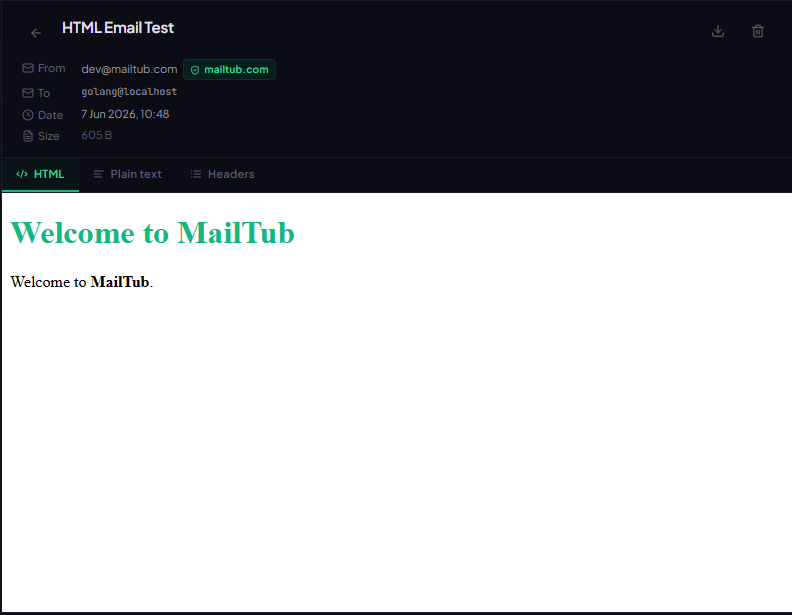
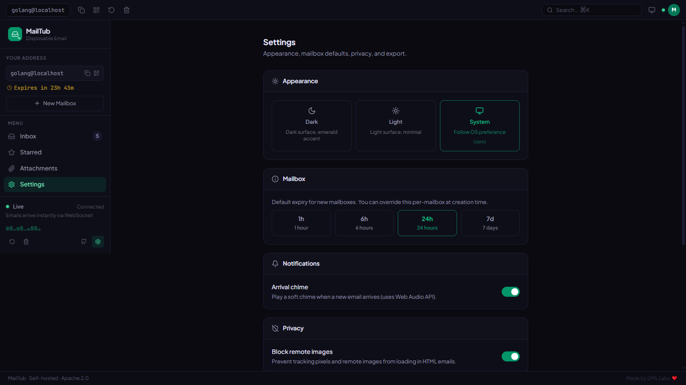
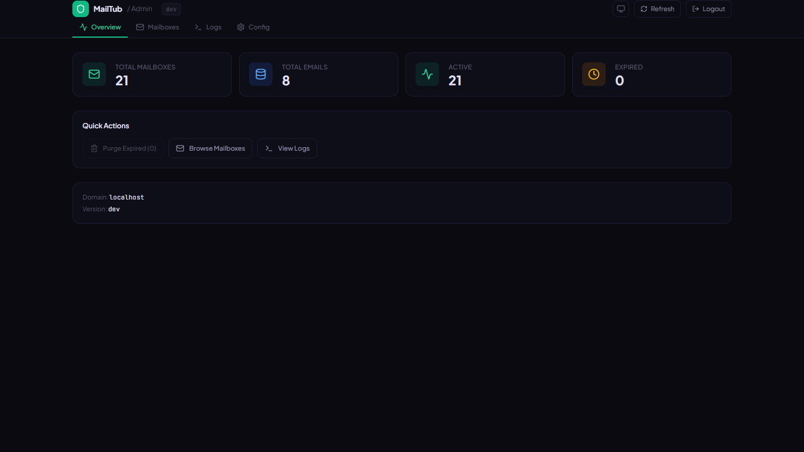
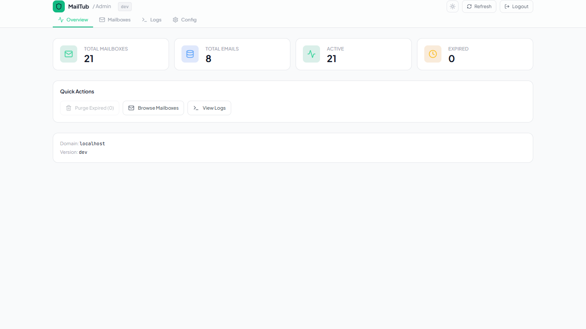
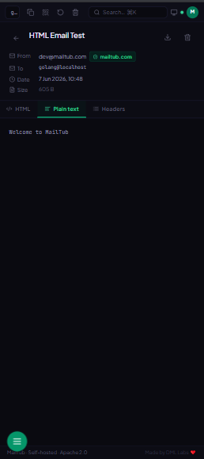

# MailTub

<p align="center">
  
</p>

<div align="center">

<!-- CI & Release -->
[](https://github.com/dml-labs/mailtub/actions/workflows/ci.yml)
[](https://github.com/dml-labs/mailtub/releases/latest)
[](https://github.com/dml-labs/mailtub/blob/main/LICENSE)

<!-- Language & Registry -->
[](https://go.dev)
[](https://github.com/dml-labs/mailtub/pkgs/container/mailtub)

<!-- Platform & Architecture -->
[](https://github.com/dml-labs/mailtub/releases)
[](https://github.com/dml-labs/mailtub/releases)
[](https://github.com/dml-labs/mailtub/releases)
[](https://github.com/dml-labs/mailtub/releases)

</div>

<p align="center">
  <strong>Self-hosted disposable email service</strong> — real-time, single binary, zero dependencies.<br>
  Spin up a temporary inbox in seconds. Emails arrive instantly via WebSocket.<br>
  No sign-up, no tracking, no long-term storage.
</p>

<p align="center">
  <a href="#quick-start">Quick Start</a> ·
  <a href="docs/configuration.md">Configuration</a> ·
  <a href="docs/api.md">API</a> ·
  <a href="docs/deployment.md">Deployment</a> ·
  <a href="CONTRIBUTING.md">Contributing</a>
</p>

---

## Screenshots

<p align="center">
  
</p>

<table>
  <tr>
    <td align="center" width="50%">
      <br>
      <sub><b>Inbox — Dark</b></sub>
    </td>
    <td align="center" width="50%">
      <br>
      <sub><b>Inbox — Light</b></sub>
    </td>
  </tr>
  <tr>
    <td align="center" width="50%">
      <br>
      <sub><b>Email Detail</b></sub>
    </td>
    <td align="center" width="50%">
      <br>
      <sub><b>Settings</b></sub>
    </td>
  </tr>
  <tr>
    <td align="center" width="50%">
      <br>
      <sub><b>Admin Panel — Dark</b></sub>
    </td>
    <td align="center" width="50%">
      <br>
      <sub><b>Admin Panel — Light</b></sub>
    </td>
  </tr>
  <tr>
    <td align="center" colspan="2">
      <br>
      <sub><b>Mobile PWA — installable on iOS & Android</b></sub>
    </td>
  </tr>
</table>

---

## Features

| Category | Details |
|----------|---------|
| 📬 **Inboxes** | Instant random addresses or custom local-parts; up to 5 simultaneous inboxes per session |
| ⚡ **Real-time** | WebSocket push — emails appear in milliseconds, no polling |
| 🕐 **Custom expiry** | Choose 1 h / 6 h / 24 h / 7 d per mailbox at creation time |
| 📎 **Attachments** | MIME parsing; per-attachment and total size caps configurable via env vars |
| 🔒 **STARTTLS** | SMTP server advertises STARTTLS; auto-generates ephemeral cert or loads your PEM |
| 🌐 **Single binary** | Go + SQLite + embedded React — one file, zero CGO, runs anywhere |
| 💻 **CLI client** | `mailtub new / list / read / watch / send` — scriptable, no browser required |
| 🎨 **3-pane UI** | Nav sidebar + email list + detail pane; dark / light / system theme |
| ⭐ **Starred emails** | Client-side starring with localStorage persistence |
| 📤 **Export** | Download inbox as `.eml` ZIP or structured JSON |
| 🛡 **Rate limiting** | 20 mailbox creations / IP / hour |
| 🔑 **Admin panel** | Password-protected dashboard — stats, mailbox management, purge expired |
| 📊 **Prometheus metrics** | `/metrics` endpoint with HTTP, SMTP, mailbox, and email counters |
| 📲 **PWA** | Installable on mobile/desktop; offline-capable via service worker |
| 🐳 **Docker** | Multi-stage distroless image (~20 MB); Docker Compose with health checks |

---

## Quick Start

### Linux

```bash
# One-line installer (Ubuntu, Debian, Fedora, Arch, Mint, Pop!_OS, Manjaro…)
curl -fsSL https://raw.githubusercontent.com/dml-labs/mailtub/main/install.sh | bash
```

Or manually for amd64:
```bash
curl -L https://github.com/dml-labs/mailtub/releases/latest/download/mailtub_linux_amd64.tar.gz | tar xz
./mailtub
```

### macOS (Intel & Apple Silicon)

```bash
curl -fsSL https://raw.githubusercontent.com/dml-labs/mailtub/main/install.sh | bash
```

Or manually:
```bash
# Apple Silicon
curl -L https://github.com/dml-labs/mailtub/releases/latest/download/mailtub_darwin_arm64.tar.gz | tar xz -C /usr/local/bin
# Intel
curl -L https://github.com/dml-labs/mailtub/releases/latest/download/mailtub_darwin_amd64.tar.gz | tar xz -C /usr/local/bin
mailtub
```

### Windows 10 / 11

```powershell
# PowerShell (run as Administrator)
$ver = (Invoke-RestMethod "https://api.github.com/repos/dml-labs/mailtub/releases/latest").tag_name
Invoke-WebRequest "https://github.com/dml-labs/mailtub/releases/download/$ver/mailtub_windows_amd64.zip" -OutFile "$env:TEMP\mailtub.zip"
Expand-Archive "$env:TEMP\mailtub.zip" -DestinationPath "C:\mailtub" -Force
C:\mailtub\mailtub.exe
```

### Android (Termux)

```bash
pkg update && pkg install curl tar
curl -fsSL https://raw.githubusercontent.com/dml-labs/mailtub/main/install.sh | bash
mailtub
```

### Docker

```bash
docker run -p 8080:8080 -p 2525:2525 \
  -v mailtub-data:/data \
  -e ADMIN_PASSWORD=changeme \
  ghcr.io/dml-labs/mailtub:latest
```

### Docker Compose / Podman

```bash
cp .env.example .env   # edit ADMIN_PASSWORD and MAILTUB_DOMAIN
docker compose up -d   # or: podman-compose up -d
```

### Build from Source

```bash
# Prerequisites: Go 1.25+, Node.js 22+, pnpm
git clone https://github.com/dml-labs/mailtub
cd mailtub
cd web && pnpm install --ignore-workspace && pnpm run build && cd ..
go build -buildvcs=false -o bin/mailtub ./cmd/mailtub
./bin/mailtub
```

Open [http://localhost:8080](http://localhost:8080) — your first inbox is ready.  
Visit `/admin` to set your admin password on first run.

---

## Configuration

Configuration is loaded in priority order: **environment variables** → **`.env` file** → **`mailtub.yaml`** → built-in defaults.

### mailtub.yaml (optional)

Create `mailtub.yaml` next to the binary as an alternative to a long list of `export` statements:

```yaml
# mailtub.yaml — all fields are optional; env vars always win
domain: mail.example.com
http_port: 8080
smtp_port: 2525
database_path: /data/mailtub.db
mailbox_ttl: 24h
log_level: info
smtp_starttls: false
api_key: ""
```

Override any value at runtime with an environment variable — it will take precedence over the file.

### Core

| Variable | Default | Description |
|----------|---------|-------------|
| `PORT` | `8080` | HTTP / WebSocket port |
| `SMTP_PORT` | `2525` | SMTP server port |
| `MAILTUB_DOMAIN` | `localhost` | Mail domain (e.g. `mail.example.com`) |
| `DATABASE_PATH` | `./data/mailtub.db` | SQLite database path |
| `MAILBOX_TTL` | `24h` | Default mailbox lifetime (`1h`, `6h`, `24h`, `168h`) |
| `LOG_LEVEL` | `info` | `debug` / `info` / `warn` / `error` |
| `APP_VERSION` | `dev` | Version string shown in UI and `/api/v1/health` |

### SMTP / TLS

| Variable | Default | Description |
|----------|---------|-------------|
| `SMTP_MAX_SIZE_MB` | `25` | SMTP message size limit (MiB) |
| `MAX_ATTACHMENT_SIZE_MB` | `25` | Per-attachment cap (MiB) |
| `MAX_TOTAL_ATTACHMENT_MB` | `50` | Total attachment cap per email (MiB) |
| `MAX_BODY_KB` | `512` | Body text truncation limit (KiB) |
| `SMTP_STARTTLS` | `false` | Enable STARTTLS on the SMTP server |
| `TLS_CERT_FILE` | _(auto)_ | Path to TLS certificate PEM |
| `TLS_KEY_FILE` | _(auto)_ | Path to TLS key PEM |

### Security

| Variable | Default | Description |
|----------|---------|-------------|
| `ADMIN_PASSWORD` | _(empty)_ | Enables the admin panel at `/admin`; set to a strong random string |
| `API_KEY` | _(empty)_ | Protects `/api/v1/*` with `X-API-Key` header auth; empty = open |

### Cache (Optional)

| Variable | Default | Description |
|----------|---------|-------------|
| `REDIS_URL` | _(empty)_ | Redis/Upstash URL for optional mailbox caching |

---

## Admin Panel

> **First-run wizard**: On first start (no password configured), visit `/admin` in your browser. MailTub redirects to `/admin/setup` where you set a password that is stored as a bcrypt hash in SQLite — nothing is printed to the terminal.

<p align="center">
  
</p>

The admin panel is available at `/admin` once a password is configured.

### First-Run Setup

On a fresh install with no `ADMIN_PASSWORD` env var set, visit `/admin` in your browser — MailTub redirects to `/admin/setup` where you create a password. It is stored as a bcrypt hash in the SQLite database. Nothing is printed to the terminal.

For Docker / CI / automated deployments, pass `ADMIN_PASSWORD` as an environment variable instead — this bypasses the wizard and the browser UI cannot change it.

```bash
# Docker / CI — use env var
docker run -e ADMIN_PASSWORD=$(openssl rand -hex 32) ghcr.io/dml-labs/mailtub:latest

# Bare-metal — visit /admin/setup in your browser after first start
./mailtub
```

### Auth Security Model

| Feature | Details |
|---------|---------|
| Password comparison | **bcrypt** (cost 10, constant-time) |
| Session token | **HMAC-SHA256** signed cookie, 24-hour TTL |
| Cookie flags | `HttpOnly`, `SameSite=Lax`, `Secure` when served over HTTPS |
| Brute-force protection | 5 failed attempts → 15-minute IP lockout |
| Audit log | All logins, logouts, deletes, and purges logged to the ring buffer |
| Config file support | `ADMIN_PASSWORD` env var only; not in `mailtub.yaml` |
| Pre-hashed passwords | Values starting with `$2a$`/`$2b$` treated as bcrypt hashes |

### Admin API Endpoints (all require session cookie)

| Method | Endpoint | Description |
|--------|----------|-------------|
| `POST` | `/admin/api/login` | Authenticate (bcrypt verify + HMAC cookie) |
| `POST` | `/admin/api/logout` | Expire session cookie |
| `GET` | `/admin/api/stats` | Mailbox/email counts + version |
| `GET` | `/admin/api/mailboxes` | Paginated mailbox list with email counts |
| `GET` | `/admin/api/mailboxes/{id}/emails` | Email list for a mailbox |
| `DELETE` | `/admin/api/mailboxes/{id}` | Delete mailbox + cascade |
| `POST` | `/admin/api/purge-expired` | Bulk delete all expired mailboxes |
| `GET` | `/admin/api/logs?n=200` | Last N log entries from ring buffer |
| `GET` | `/admin/api/config` | Read-only server configuration view |

### Dashboard Tabs

- **Overview** — stat cards (total/active/expired mailboxes, email count), quick actions, version info
- **Mailboxes** — searchable/filterable table; expand rows to browse emails and view body text
- **Logs** — live log viewer (5-second auto-refresh), filter by level (DEBUG/INFO/WARN/ERROR), text search. Audit events are tagged with `"audit": true`
- **Config** — read-only view of current server configuration with copy buttons

---

## Prometheus Metrics

The `/metrics` endpoint exposes Prometheus-compatible metrics.

```bash
# Scrape metrics (open endpoint when ADMIN_PASSWORD is not set)
curl http://localhost:8080/metrics

# Protected endpoint — use admin Bearer token
curl -H "Authorization: Bearer $ADMIN_PASSWORD" http://localhost:8080/metrics
```

Key metrics:

| Metric | Type | Description |
|--------|------|-------------|
| `mailtub_emails_received_total` | Counter | Emails received via SMTP (by domain) |
| `mailtub_mailboxes_created_total` | Counter | Mailboxes created (by domain) |
| `mailtub_mailboxes_deleted_total` | Counter | Mailboxes deleted (by domain + reason) |
| `mailtub_ws_connections_active` | Gauge | Active WebSocket connections |
| `mailtub_smtp_connections_total` | Counter | SMTP connections accepted |
| `mailtub_http_requests_total` | Counter | HTTP requests by method, route, status |
| `mailtub_http_request_duration_seconds` | Histogram | HTTP latency |

**Prometheus scrape config:**

```yaml
scrape_configs:
  - job_name: mailtub
    static_configs:
      - targets: ["mailtub:8080"]
    authorization:
      type: Bearer
      credentials: "<your ADMIN_PASSWORD>"
```

---

## API Key Authentication

Protect the REST API for multi-tenant or public deployments:

```bash
API_KEY=$(openssl rand -hex 32) ./mailtub

# Include header in every request
curl -H "X-API-Key: $API_KEY" http://localhost:8080/api/v1/mailbox
```

- The `/api/v1/health` endpoint is always public (for health checks)
- Keys can also be passed as `?api_key=…` query parameter
- When `API_KEY` is not set, the API is open (default for self-hosting)

---

## SMTP Setup

MailTub listens for incoming email on port `2525` by default.  
To receive real email you need:

1. **A domain** with an MX record pointing to your server IP.
2. **Port 25 open** (or redirect 25 → 2525 with `iptables`).
3. **Set `MAILTUB_DOMAIN`** to match your MX domain.

```bash
# Redirect port 25 → 2525 (Linux)
iptables -t nat -A PREROUTING -p tcp --dport 25 -j REDIRECT --to-port 2525
```

### STARTTLS

```bash
# Auto-generate self-signed cert (dev / testing)
SMTP_STARTTLS=true ./mailtub

# Production — provide your own certificate
SMTP_STARTTLS=true \
  TLS_CERT_FILE=/etc/certs/cert.pem \
  TLS_KEY_FILE=/etc/certs/key.pem \
  ./mailtub
```

---

## CLI Client

```bash
# Create a new mailbox
./mailtub new

# Create a custom mailbox
./mailtub new --local-part mytemp

# List emails
./mailtub list mytemp@localhost

# Read an email by ID
./mailtub read mytemp@localhost <email-id>

# Watch for new emails in real-time (WebSocket)
./mailtub watch mytemp@localhost

# Send a test email
./mailtub send mytemp@localhost
./mailtub send mytemp@localhost --subject "Hello" --starttls
```

Set `MAILTUB_SERVER=http://my-server.com` to point the CLI at a remote instance.

---

## REST API

| Method | Endpoint | Description |
|--------|----------|-------------|
| `POST` | `/api/v1/mailbox` | Create mailbox (`localPart?`, `ttlHours?`) |
| `GET` | `/api/v1/mailbox/{address}` | Mailbox info + email count |
| `DELETE` | `/api/v1/mailbox/{address}` | Delete mailbox |
| `GET` | `/api/v1/mailbox/{address}/emails` | List emails (`limit`, `offset`) |
| `GET` | `/api/v1/mailbox/{address}/emails/{id}` | Email detail |
| `DELETE` | `/api/v1/mailbox/{address}/emails/{id}` | Delete email |
| `PATCH` | `/api/v1/mailbox/{address}/emails/{id}/read` | Mark read |
| `GET` | `/api/v1/mailbox/{address}/emails/{id}/attachments/{aid}` | Download attachment |
| `GET` | `/api/v1/health` | Health check (always public) |
| `GET` | `/ws` | WebSocket endpoint |
| `GET` | `/metrics` | Prometheus metrics |

**Create a mailbox with 1-hour expiry and custom address:**
```bash
curl -X POST http://localhost:8080/api/v1/mailbox \
  -H "Content-Type: application/json" \
  -d '{"localPart": "mytemp", "ttlHours": 1}'
```

---

## Architecture

```
┌──────────────────────────────────────────────────────┐
│                    Single Go Binary                  │
│                                                      │
│  ┌──────────────┐   ┌──────────────────────────┐     │
│  │  SMTP Server │   │       HTTP Server        │     │
│  │   :2525      │   │         :8080            │     │
│  └──────┬───────┘   └────────────┬─────────────┘     │
│         │                        │                   │
│  ┌──────▼────────────────────────▼──────────┐        │
│  │          chi Router                      │        │
│  │  /api/v1/*  ·  /admin/*  ·  /metrics     │        │
│  │  /ws  ·  /* (SPA)                        │        │
│  └──────────────────────┬───────────────────┘        │
│                         │                            │
│  ┌──────────────────────▼───────────────────┐        │
│  │     SQLite (modernc.org/sqlite — CGO-free)│        │
│  └──────────────────────────────────────────┘        │
│                                                      │
│  ┌──────────────────────────────────────────┐        │
│  │     Embedded React SPA (web/dist)        │        │
│  │  Tailwind v3 · Framer Motion · PWA       │        │
│  └──────────────────────────────────────────┘        │
└──────────────────────────────────────────────────────┘
```

---

## Attachment Size Limits

Two-layer enforcement via environment variables:

| Layer | Variable | Default | Behaviour |
|-------|----------|---------|-----------|
| SMTP protocol | `SMTP_MAX_SIZE_MB` | 25 MiB | Reject messages before DATA stream |
| Per attachment | `MAX_ATTACHMENT_SIZE_MB` | 25 MiB | Skip oversized attachment; email still saved |
| Total attachments | `MAX_TOTAL_ATTACHMENT_MB` | 50 MiB | Skip attachments once budget exhausted |
| Body text/HTML | `MAX_BODY_KB` | 512 KiB | Truncate with notice appended |

---

## Progressive Web App (PWA)

<p align="center">
  
</p>

MailTub's web UI is installable as a PWA on any device:

- **iOS** — open in Safari → Share → Add to Home Screen
- **Android** — open in Chrome → ⋮ → Add to Home Screen
- **Desktop** — click the install icon in the address bar

The service worker precaches all assets and uses a network-first strategy for API calls (5-minute TTL).

---

## Contributing

See [CONTRIBUTING.md](CONTRIBUTING.md) for development setup, code style, and PR process.

## Security

Report vulnerabilities to **devmayank-inbox@gmail.com** — see [SECURITY.md](SECURITY.md).

## License

Apache 2.0 — see [LICENSE](LICENSE).

---

*Developed by [DML Labs](https://github.com/dml-labs) — Founder & Lead Engineer: [@Devmayank-official](https://github.com/Devmayank-official)*
